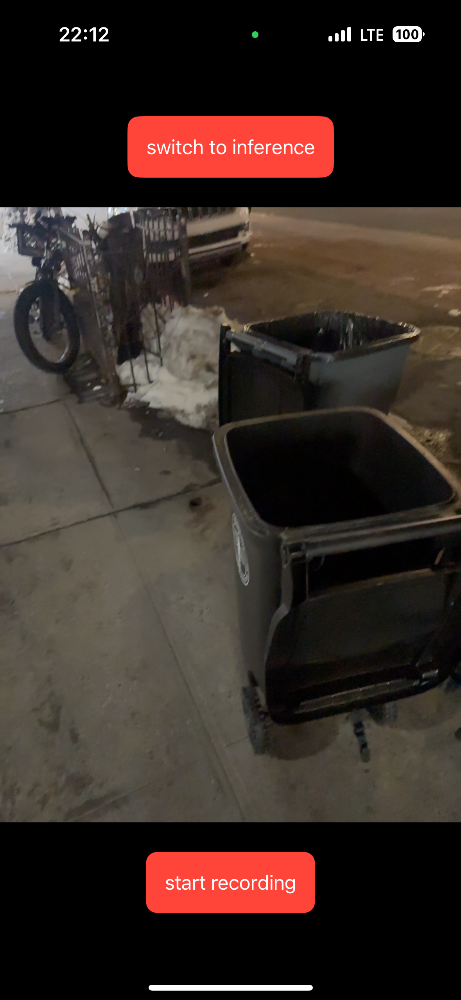
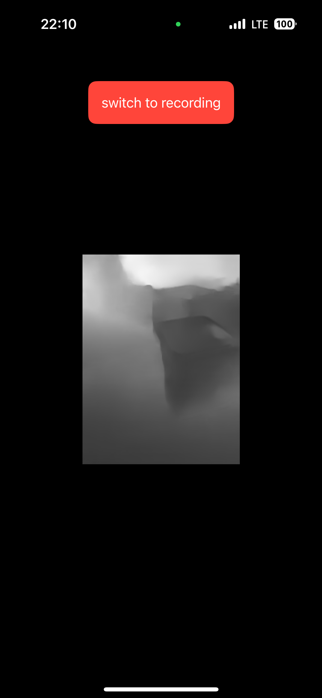
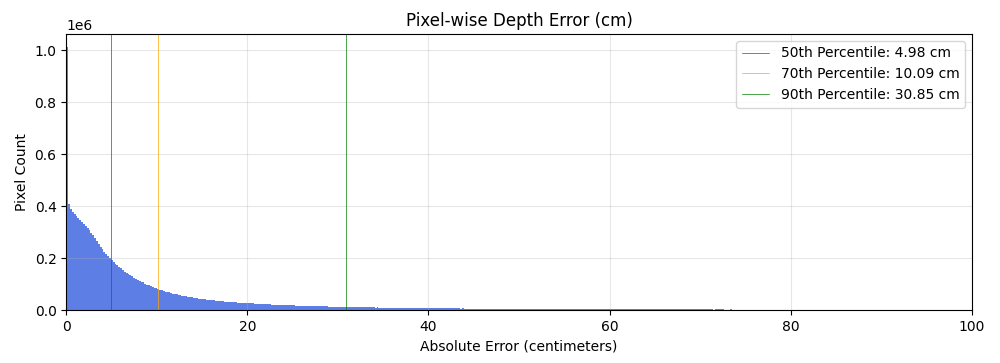
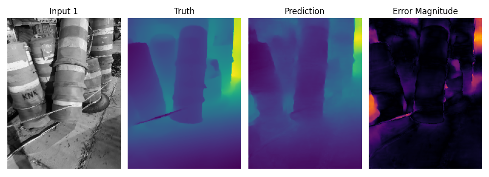
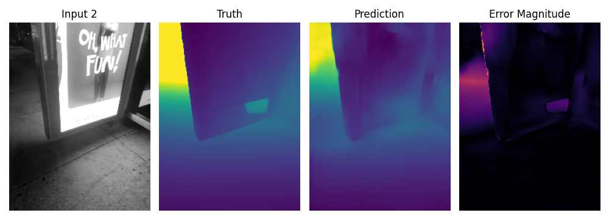
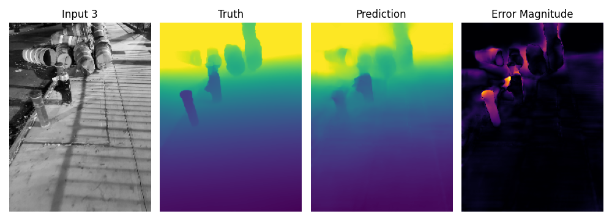

# passive_wifi_positioning

## Purpose:

This system implements an end-to-end monocular depth-mapping pipeline using a U-Net-based convolutional neural network trained on ground-truth depth from a mobile Lidar sensor. Synchronized pairs of grayscale images and depth data were collected and used to supervise the training of a model that predicts per-pixel depth from a single grayscale frame with high accuracy on a validation set. The model was then exported to CoreML for high-efficiency real-time inference at 60fps on a mobile device using image data only, providing depth-sensing capabilities where Lidar sensors are unavailable. The fundamental goal is to make progress toward solving the "vision problem", matching human depth perception without requiring ToF-based sensor augmentation, or stereoscopic vision.  
  

## Prerequisites:

**Location** – This model was trained on low-light outdoor imagery in a dense urban environment. All data was collected at night to allow for maximum range of the Lidar sensor, providing a complex 3D environment with minimal infrared noise floor from sunlight.

**Hardware** – An iPhone 12+ Pro (equipped with Lidar) is required to run the data collection application, collecting 5 frames per second from both image and Lidar sensors. Training the CNN requires a laptop/desktop GPU with a minimum of 6GB VRAM.

**Training Dataset** -  A diverse set of 3D environments were included in the training data, consisting of groups of 10-50 images, taken from different perspectives. The training data should include a minimum of 2000 samples to achieve an acceptable level of global performance.

**NOTES:** 

-Core iPhone application files are included in this repository, but the full app project folder was omitted for simplicity. The application can easily be built in Xcode by importing the included files. Camera and File Access permissions must be requested in the info.plist.  

## Data Collection:

1) In the iPhone application, the "start recording" button begins a collection of images and Lidar data at 5 frames per second.

2) When the "stop recording" button is pressed, collected data is saved locally to the device as csv/png pairs, grouped into a new folder for each capture session.

3) Multiple such "videos" are recorded, with the frame-rate slowed to allow for greater variation between images. Images are automatically downsized to 128x196, downsampled to 8-bit, and adjusted to grayscale within the application to align with the depth-map. 

4) Data is transferred to the GPU-equipped desktop/laptop platform for model training.

*Figure 1 - Depth App - Data Collection Process*

**NOTES:**

-Model performance in a global context is heavily influenced by the diversity of environments included in the training data.

-The depth/image complexity of the recorded data must be carefully monitored, as inclusion of data which is too geometrically sparse, or too complex, will provide less value during training.

-In retrospect, it would have been beneficial to reduce depth data to an 8-bit png format, rather than a csv, to reduce dataset size. This will be explored in future versions.

  

## Training:

1) The training datasets are placed in the active directory, the script "concat.py" is run, which accesses all folders in the current directory, complies their csv/png data, and sequentially renames and saves them into a subfolder "/data". 

2) The script "prepare.py" is run, which fetches the raw csv/png data from the "data" folder, converts it to numpy arrays and saves them as "dists.npy"/"image_data.npy" for use by the training script. All images/depthmaps are displayed in a GUI for inspection.

3) The script "train.py" is run (importing from model.py), which fetches data from the numpy arrays. Validation data is randomly split off, excluded from the training set, and saved as a separate set of numpy arrays with "_validation" appended to the filename. The script randomly downsizes the image data from 80%-100% of its original size, then restores it using cv2.INTER_AREA to original size, ensuring data variation. It trains the U-Net CNN, and saves the trained model to the same directory as both a .pth file and a coreML file, for inference locally or on Apple devices.

  

**NOTES:**

-During training, it was observed that increasing model depth and "width" (increasing parameters) improves performance. The number of epochs also improved accuracy on the validation set with unexpected performance improvements, increasing slowly but linearly, beyond the exponential decay point. Such behavior is indicative of overfitting to the 50-100 3D scenarios on which the model was trained. Adding additional training sets may improve global performance.

  

## Inference:

1) The script "test.py" is run (importing from model.py), imports data from the validation numpy arrays, and runs inference on the validation set. A GUI displays the pixel-wise performance, and provides an image-based, sample-by-sample overview of the entire validation set, featuring truth, prediction and an error map.

2) The coreML model is exported to the iOS mobile device application to run real-time inference on live video data at 60 fps. Results are shown below.

*Figure 2 - Depth App - Inference Mode*

## Results:

1) The test script produces a results plot indicating a 4.98 cm median pixel-wise error for all validation images, with a 90th percentile error of 30.85 cm.

2) Running inference on the app using live camera data delivers visually less impressive results when compared to the validation set. This is likely due to the fact that the validation set includes images highly similar to the training set. Further expansion of the training data would likely greatly improve global performance.

*Figure 3 - Accuracy Visualization from Validation Set* 

*Figure 4 - Pixel-Wise Accuracy Results* 
